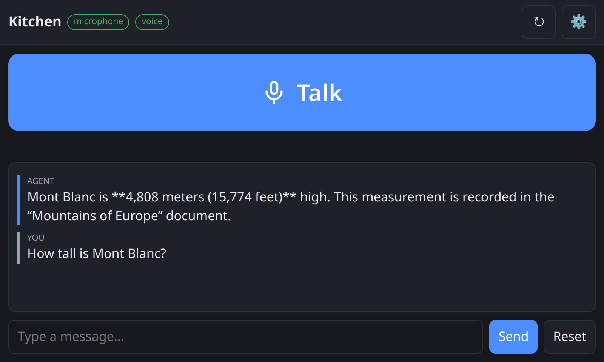

# MyAgent

**An AI assistant that keeps working when the internet doesn't.**

MyAgent is a self-hosted agent platform designed to be useful **offline**: it
runs local models (via [llama.cpp](https://github.com/ggml-org/llama.cpp) or
[Ollama](https://ollama.com)), answers from a **local knowledge library** — a
full offline Wikipedia plus your own notes and documents — and talks to the
**IoT and home-automation devices on your LAN**. No cloud account, no
outbound traffic required. Point it at a remote API instead if you want to;
that's a choice, not a dependency.

Think: a boat, a mountain hut, a lab with no uplink, a blackout, or simply a
home where you'd rather not send everything to someone else's server.


*A local model answering from an offline Wikipedia archive: the Librarian
searches the library, opens the best hit and answers from it. Nothing in that
path touches the network.*

## Features

- **Works offline** — local model + local knowledge + local devices. Nothing
  in the core path needs an internet connection
- **Offline knowledge library** — drop Wikipedia ZIM archives and your own
  Markdown/text documents into `~/myagent/library/`; agents search them
  full-text and read what they find
  (see [Offline knowledge](#offline-knowledge-the-library))
- **IoT & home automation** — agents call your devices' local HTTP APIs
  (Home Assistant, Shelly, Tasmota, ESPHome, Hue …) over the LAN
  (see [Local devices](#local-devices--home-automation))
- **Atomic agents** — each agent is just `model + system prompt + tools`,
  editable from the UI and stored as a JSON file
- **Long-term memory** *(opt-in, per agent)* — old conversation turns are
  automatically archived into a per-agent memory tree and replaced by compact
  summaries, so an agent remembers across chats without blowing up a small
  model's context; the `memory_search` / `memory_read` / `memory_note` tools
  let it explore and annotate that memory
- **Autonomous agents** *(opt-in, per agent)* — give an agent a **scheduled
  task** ("every Monday at 9", "every 20 minutes", "in one hour") and switch it
  **Live**: it runs unattended, takes initiatives, schedules its own future work
  (`manage_tasks`) and reaches you where you are — Telegram, or out loud on a
  voice satellite (`notify_user`, which takes a contact's name). Tasks
  are editable from the Tasks page or by asking the agent; a started agent
  restarts by itself after a reboot, and stopping it is one click
- **Agent delegation** — agents can call other agents (`call_agent`), with
  per-agent permission control
- **Folder-based tools** — a tool is a folder with a `tool.json` and an
  executable `run` script in any language; hot-reloaded, no restart needed.
  The AI can write its own tools
- **MCP servers** — connect Model Context Protocol servers (local processes over
  stdio, or remote ones over HTTP) and their tools become available to your
  agents like any other tool; paste an existing Claude Desktop configuration to
  import them (see [MCP servers](#mcp-servers))
- **Works with tool-less models** — tool calls are also parsed from plain
  model text, so small local models without native function calling still work
- **Any backend** — llama.cpp, Ollama, any OpenAI-compatible API (OpenAI,
  OpenRouter, Groq, vLLM …) and the Anthropic API, which is spoken natively.
  A model's context window is *probed* from the backend, not typed in and hoped
  for
- **Live chat** — token streaming, background generation you can leave and
  re-attach to, stop button, session history; regenerate an answer, edit a
  prompt and send it again, copy any answer as Markdown
- **Thinking models** — a reasoning model's chain-of-thought (a
  `reasoning_content` field or an inline `<think>…</think>`) is peeled off while
  it streams and shown collapsed above the answer: it never lands in the reply,
  in the next prompt, or in a voice device's speaker
- **Telegram and voice** — bridge an agent to a Telegram bot, or to a **voice
  satellite**: a microphone and a speaker on a Raspberry Pi (or any spare PC)
  that you talk to and that answers out loud, with the speech recognized on
  your own server (see [Talking to it](#talking-to-it-telegram-and-voice)).
  Both come from one optional plugin, installed separately
- **Optional online tools** — web search and page reading are there when you
  *do* have connectivity, in a separate agent
- **Installable** — the UI installs as an app (own window, launcher/home-screen
  icon) and its interface is cached, so it opens with the network down
  (see [Install it as an app](#install-it-as-an-app))
- **i18n UI** — English and Italian out of the box

## What's different

Most self-hosted agent platforms assume connectivity and a frontier model.
MyAgent assumes neither, and that assumption is the whole design:

**Small local models are the target, not a compatibility mode.** This is the
part a feature list can't show. Tool calls are parsed from plain model text when
the model has no native function calling; a call that *tried* to be a tool call
and didn't parse is handed back for a retry instead of becoming the answer;
identical consecutive calls are dropped so a small model can't loop; the textual
tool documentation is injected **only** when the model has no native tool
support, because serving both protocols at once makes models write JSON as prose;
deciding and answering use separate temperatures; the context window is *probed*
from the backend rather than typed in and hoped for; and an autonomous wake gets
no chat history, because a recurring task's history is dozens of near-identical
copies of itself and a small model will happily parrot its own last output. Each
of those is a bug we hit with a real 8B model, not a theory.

**Tools are files.** A tool is a folder with a `tool.json` and an executable
`run` in any language, reading JSON on stdin and writing to stdout. You version
it with git, edit it with your editor, and it hot-reloads — no admin UI, no
database row, no build step. The AI writes new ones in exactly that format, so
there's nothing to register and nothing to migrate.

**Offline is the default path, not a degraded mode.** The bundled Master routes
general-knowledge questions to the Librarian *before* the Web Researcher, and the
web tools are quarantined in one agent you can delete. Nothing in the core path
needs a socket to the internet; the online extras are optional and marked as
such.

### Deliberately not here

- **No visual workflow builder.** An agent is a model, a prompt and a list of
  tools. If you want to draw a graph, [Dify](https://dify.ai),
  [Flowise](https://flowiseai.com) and [n8n](https://n8n.io) do it well.
- **No embeddings, no vector database.** The library is searched with the ZIM
  full-text index and a keyword scorer. Semantic search is planned and will stay
  optional: on a disconnected box a second resident model costs exactly the VRAM
  your chat model needs. For an embeddings-first document assistant,
  [Khoj](https://github.com/khoj-ai/khoj) or
  [AnythingLLM](https://anythingllm.com) are the better tool today.
- **No multi-user accounts or RBAC.** One trusted user — see
  [Security](#security).
- **No sandbox.** Tools run as the server user. That's what makes "a folder with
  a `run` script" powerful, and it's why the API binds to `127.0.0.1` by default.
- **Nothing to compile.** Python standard library + FastAPI on the backend,
  vanilla JS + Bootstrap on the frontend, four runtime dependencies.

## Requirements

- **Python 3.10+** (3.12 recommended)
- At least one LLM backend — for a fully offline setup, a local one:
  - llama.cpp server (`http://localhost:8080`), or
  - Ollama (`http://localhost:11434`), or
  - any remote OpenAI-compatible API with an API key — OpenAI, OpenRouter,
    Groq, Mistral, a vLLM box on the LAN … *(needs internet)*, or
  - the Anthropic API (Claude), spoken natively *(needs internet)*
- **`libzim`** *(optional)* — to search offline Wikipedia archives
- **Node.js + Chrome/Chromium** *(optional)* — only for the online web tools

## Quickstart

```bash
git clone https://github.com/speleoalex/myagent.git
cd myagent
./setup.sh
server/.venv/bin/python server/main.py
```

Open **<http://127.0.0.1:8888>**, pick an agent and chat. On first run MyAgent
seeds `~/myagent/` with the bundled agents, models and tools; point the
default model at your backend under **Models** if it isn't llama.cpp on
`localhost:8080`.

## Offline knowledge (the library)

Everything in `~/myagent/library/` becomes searchable knowledge for your
agents. Two kinds of files live side by side in that folder:

| Put in `~/myagent/library/` | Searched how |
|---|---|
| **Wikipedia / ZIM archives** (`*.zim`) | full-text index built into the archive |
| **Your notes and documents** (`.md`, `.txt`, `.rst`) | keyword scorer, one result per section |

Searching happens in two steps, so an agent pays for the text it actually
wants: `local_search` returns a compact list (`id | title | snippet`, a few
hundred tokens for the whole list) and `local_read` opens one of those ids at
length, a page at a time for long documents.

The **Librarian** agent is wired to both out of the box: ask it a question and
it searches the library, reads the best hit and answers from what it finds —
citing the article or file — or tells you the library doesn't cover it. The
**Master** agent delegates general-knowledge questions to it before touching
the web.

### Getting an offline Wikipedia

Download a `.zim` from [Kiwix](https://download.kiwix.org/zim/wikipedia/) and
drop it in the folder — no import step, no restart:

```bash
mkdir -p ~/myagent/library
cd ~/myagent/library
# ~12 GB for the full English "mini" edition; smaller editions exist
wget https://download.kiwix.org/zim/wikipedia/wikipedia_en_all_mini.zim
server/.venv/bin/pip install libzim      # required for .zim files only
```

Several archives can coexist (e.g. English + Italian); an agent can restrict
a search to one edition with the tool's `lang` parameter.

### Your own documents

Copy Markdown or plain-text files (manuals, procedures, notes, wiki exports)
straight into `~/myagent/library/` — subfolders are scanned recursively.
PDFs, images and audio are **not** searched directly: convert them first with
the `document_extract` tool (ask an agent to extract the file and write the
Markdown into the library), then they become searchable like any other note.

Each agent can also have its **own** knowledge folder instead of the shared
one — both library tools take an optional `path`.

## Local devices & home automation

Agents reach the devices on your LAN through the `http_request` tool, which
speaks the local HTTP APIs that home-automation gear already exposes — Home
Assistant, Shelly, Tasmota, ESPHome, Philips Hue, ESP32 sketches, a Raspberry
Pi you wrote yourself. This all happens inside your network: no vendor cloud,
no internet.

The bundled **Home Automation** agent is a template: open it in
**Agents → Home Automation** and list your devices in the *My devices*
section of its system prompt, one line each with the exact URL to call —

```text
- Living room light (Shelly): ON -> GET http://192.168.1.50/relay/0?turn=on
- Home Assistant: POST http://192.168.1.10:8123/api/services/light/turn_on
  header {"Authorization": "Bearer TOKEN"}  body {"entity_id": "light.kitchen"}
```

— then just say *"turn on the living room light"*. For protocols beyond HTTP
(MQTT, Zigbee, serial, GPIO) write a tool: a folder with a `tool.json` and a
`run` script that shells out to `mosquitto_pub`, a Python library, or
whatever your hardware speaks — see [docs/TOOLS.md](docs/TOOLS.md).

## Talking to it: Telegram and voice

An agent does not have to be used from a browser. The optional **connectors
plugin** ([connectors/](connectors/README.md), installed separately) binds an
agent to a channel, and gives it a way to reach *you*:

- **Telegram** — a bot answers as the agent bound to it, for the users you
  allow. Voice notes are transcribed on your server before the agent sees them.
- **Voice satellite** — a microphone and a speaker on a Raspberry Pi or a spare
  PC ([satellite/](satellite/README.md)). You talk, the recording goes to
  MyAgent and is transcribed there (Whisper), the agent answers, and the device
  speaks the reply with [Piper](https://github.com/rhasspy/piper). It also
  listens on `/say`, so an agent can make the kitchen speaker announce
  something by itself.



*The satellite serves its own page — talk, type, tune the device — laid out for
the 800×480 touch panel such a device usually has. The same settings are also
editable from MyAgent, under Connectors.*

Both directions stay on your network, and an agent addresses people by **name**:
the plugin keeps an address book where a contact has one handle per channel, so
`notify_user` can be told *"tell Sylvia the backup finished"* — on Telegram, or
out loud in the kitchen.

## MCP servers

Besides its own folder-based tools, MyAgent speaks the
[Model Context Protocol](https://modelcontextprotocol.io): add a server under
**Tools → MCP servers** and its tools show up in the agent editor like any other
tool. Two transports are supported — **stdio**, where the server runs as a local
child process, and **HTTP** (Streamable HTTP) for remote or LAN servers.

```text
Command:    /usr/bin/npx
Arguments:  -y
            @modelcontextprotocol/server-filesystem
            /home/me/documents
```

**Test connection** probes the server with the values in the form — saved or not —
and lists the tools it found, with the exact name each one will have for the model
(`mcp_<server>_<tool>`). **Import JSON** takes an `mcpServers` block straight from
a Claude Desktop / VS Code / Cursor configuration, reporting per entry what it
created and what it skipped (an entry using the deprecated `sse` transport is
skipped rather than imported as something that would only fail later).

In the agent editor each server appears as a group with an *all tools from this
server* entry: pick that and tools added on the server later are picked up
automatically, or select them one by one. Selecting fewer is often better — every
tool description ends up in the model's prompt, which matters with a small local
model. Each server also has *allowed / excluded tools* fields for the same reason.

A server is connected when it is saved or edited (so its tools show up in the
agent editor right away) and otherwise only when an agent that uses it runs a
turn; all of them are shut down with MyAgent. If a server becomes unreachable the
agent keeps working with its other tools — the failure is reported to the model as
a tool error and shown in the servers list — and its previously discovered tools
stay on offer until a refresh succeeds. Notes and limits:

- `npx` needs `-y`, otherwise it waits for a confirmation nobody can give. Under
  systemd/launchd prefer an absolute path (`/usr/bin/npx`): the service's `PATH`
  is minimal.
- The first connection to an `npx -y` server can take tens of seconds while it
  downloads. Use *Test connection* first; the turn that triggers it does not wait
  forever, it just runs without that server.
- Authentication is a static bearer token or custom headers; OAuth flows are not
  supported.
- Tokens in `env`/`headers` are stored under `~/myagent/config/mcp/` with `0600`
  permissions and are never sent back to the browser.

## Security

> **MyAgent includes tools that execute shell commands as the server user.**
> By default the API has no authentication and binds to `127.0.0.1` — keep it
> that way unless the network is trusted. Before exposing it, set an API key:
> every `/api` request then requires it, either as an
> `Authorization: Bearer <key>` header or as an `?api_key=<key>` query
> parameter. The web UI asks for the key on first use (or open it once as
> `http://host:8888/?api_key=<key>` — the key is stored in the browser and
> stripped from the URL). For anything internet-facing, still prefer an
> authenticating reverse proxy on top.
>
> Two ways to set it, and they are not interchangeable:
>
> - **Settings → API key** generates, changes or removes it from the UI. It is
>   stored in `~/myagent/config/api_key` (`0600`) and takes effect on the next
>   request — no restart, so in-flight turns survive. The page also shows the
>   `?api_key=` link to open on another device.
> - **`MYAGENT_API_KEY`** pins it at the deployment level (systemd drop-in,
>   container env, read-only install). When set it **wins**, and the Settings
>   box turns read-only: the process's own configuration is not something an
>   API call gets to overwrite.
>
> Over plain http the key travels in clear on every request. Either keep the
> traffic inside a VPN, or give MyAgent a certificate and let it serve HTTPS
> itself (`MYAGENT_SSL_CERTFILE` / `MYAGENT_SSL_KEYFILE`, see
> [Installing from another device](#installing-from-another-device)).
>
> The same applies to MCP servers: adding one with the `stdio` transport means
> MyAgent runs that command locally, and its tool descriptions become part of
> your agents' prompts — so only add servers you trust.

## Install it as an app

Open *Settings → Install app* and MyAgent installs like a native application:
its own window, an icon in the launcher or on the home screen, no address bar.
The interface is cached, so it opens even with the network down — the agents
themselves keep needing the server, which is the point of running it on your
own machine.

On iPhone and iPad, Safari has no install button: use *Share → Add to Home
Screen*.

### Installing from another device

Browsers only offer this over a **secure connection**. `http://localhost:8888`
counts as one, so the default setup works as is — but a LAN or VPN address in
plain http does not, and the browser withholds both the install prompt and the
offline cache without explaining why (Settings says so, instead of showing a
button that does nothing).

MyAgent can serve HTTPS itself, no reverse proxy involved:

```bash
MYAGENT_SSL_CERTFILE=/path/fullchain.pem MYAGENT_SSL_KEYFILE=/path/privkey.pem \
  server/.venv/bin/python server/main.py
```

(Omit `MYAGENT_SSL_KEYFILE` if the certificate file is a combined PEM.)

What matters is that the certificate is **trusted**, not merely present: with a
self-signed one you click through, the origin keeps a certificate error and
Chrome refuses to register the service worker — no install, no offline. Three
ways to get a trusted one for a private address:

- **`tailscale cert`** — a real certificate for your `*.ts.net` name, renewed
  automatically, trusted everywhere without touching any device.
- **Let's Encrypt via DNS-01** — point a domain you own at the private IP
  (`myagent.example.com` → `10.147.0.5`). The DNS challenge needs no inbound
  reachability, so it works for an address only your VPN can reach.
- **[mkcert](https://github.com/FiloSottile/mkcert)** — a local CA, quick on
  your own machines, fiddly to install on a phone.

If you are on Chrome and the traffic is already encrypted by a VPN
(WireGuard, Tailscale, ZeroTier), there is a cheaper route: add the origin to
`chrome://flags/#unsafely-treat-insecure-origin-as-secure`, once per browser.
Safari has no such flag, so an iPhone needs a real certificate.

## Hosting the UI elsewhere

By default MyAgent serves its own UI, and the UI talks to the origin it was
loaded from — nothing to configure. But the UI is plain static HTML (`ui/`),
so any web server can host it, at any path (asset references are relative):
copy the `ui/` folder to an Apache/nginx document root and tell it where the
API lives.

Two pieces make the split work:

1. **Point the UI at the server** — in *Settings → MyAgent server*, or by
   opening the UI once as `http://apache-host/myagent/?server=http://myagent-host:8888`
   (stored in the browser and stripped from the URL, like `?api_key=`; an empty
   `?server=` resets it to same-origin).
2. **Let the browser through** — cross-origin calls need the server's CORS
   consent: start MyAgent with
   `MYAGENT_CORS_ORIGINS=http://apache-host` (comma-separated list, `*` for any).
   Unset, the API stays same-origin only, which is the right default for the
   classic single-server setup.

Remember that the server must also be reachable from the browser's machine
(`MYAGENT_HOST=0.0.0.0` + `MYAGENT_API_KEY`, see [Security](#security)).

## Runtime layout

MyAgent keeps all runtime state under `~/myagent/`, decoupled from the code:

```text
~/myagent/
├── config/      # agents, models (API keys, 0600), MCP servers, settings — small & precious: back this up
├── connectors/  # channel bindings (bot tokens and device keys, 0600), grants, address book
├── plugins/     # installed plugins — code, replaceable (see docs/PLUGINS.md)
├── tools/       # your tools: the ones you (or the AI) create, plus your edits to the built-in ones
├── library/     # your offline knowledge: Wikipedia ZIM archives + notes/documents
├── workspace/   # working directory for agents' file operations
├── sessions/    # chat state: current, history, connector channels
├── memory/      # per-agent long-term memory (only for agents that enable it)
├── autonomy/    # live agents' state and event queues (only for started agents)
└── logs/        # debug.log (only with MYAGENT_DEBUG=1)
```

A full backup of everything that matters:
`tar czf myagent-backup.tgz -C ~ myagent/config myagent/connectors`

## Configuration

Everything is configured via environment variables (none are required):

| Variable             | Default                | Meaning                                    |
|----------------------|------------------------|--------------------------------------------|
| `MYAGENT_HOST`       | `127.0.0.1`            | bind address (see [Security](#security))   |
| `MYAGENT_PORT`       | `8888`                 | bind port                                  |
| `MYAGENT_API_KEY`    | *(unset)*              | pin the API key (Bearer header or `?api_key=`); overrides — and makes read-only — the one managed in Settings → API key |
| `MYAGENT_CORS_ORIGINS` | *(unset = same-origin only)* | comma-separated browser origins allowed to call the API (for a [UI hosted elsewhere](#hosting-the-ui-elsewhere)) |
| `MYAGENT_SSL_CERTFILE` | *(unset = plain http)*  | TLS certificate — serve HTTPS directly, no reverse proxy (see [Install it as an app](#install-it-as-an-app)) |
| `MYAGENT_SSL_KEYFILE` | *(unset)*               | TLS private key; omit if the certificate file is a combined PEM |
| `MYAGENT_CONFIG`     | `~/myagent/config`     | agents, models, MCP servers, settings      |
| `MYAGENT_TOOLS`      | `~/myagent/tools`      | tool folders                               |
| `MYAGENT_WORKSPACE`  | `~/myagent/workspace`  | agents' file-operation root                |
| `MYAGENT_SESSIONS`   | `~/myagent/sessions`   | chat sessions                              |
| `MYAGENT_MEMORY`     | `~/myagent/memory`     | per-agent long-term memory                 |
| `MYAGENT_AUTONOMY`   | `~/myagent/autonomy`   | live agents' state and event queues        |
| `MYAGENT_LIBRARY`    | `~/myagent/library`    | offline knowledge folder (library tools)   |
| `MYAGENT_PLUGINS`    | `~/myagent/plugins`    | installed plugins                          |
| `MYAGENT_CHANNEL_ROTATE_BYTES` | `2 MiB`      | size at which a channel session is archived and restarted |
| `MYAGENT_DEBUG`      | *(off)*                | `1` = verbose executor trace (full chat content) |
| `MYAGENT_DEBUG_FILE` | `~/myagent/logs/debug.log` | trace file location                    |
| `MYAGENT_OLLAMA_DEFAULT_CTX` | `4096`         | assumed context window of an Ollama model when not probed |
| `MYAGENT_MCP_SHUTDOWN_TIMEOUT` | `10`         | seconds shutdown waits for MCP servers to close |

The connectors plugin adds a few of its own (state directory, poll timeout,
Whisper model) — see [connectors/README.md](connectors/README.md).

## Bundled agents and models


*The seven bundled agents, each on the model chosen in Settings (`default`).
The play button on a card starts that agent as a
[live autonomous agent](#autonomous-agents).*

First run seeds seven agents:

| Agent | Does | Needs internet? |
|---|---|---|
| **Master** | orchestrator: routes your question to the right agent via `call_agent` | no |
| **Librarian** | answers from the offline library (Wikipedia ZIM + your documents) | no |
| **Home Automation** | drives IoT devices over their local HTTP APIs — customize with your devices | no |
| **System Administrator** | shell and file operations on the machine | no |
| **Conversation** | plain chat | no |
| **Tool Manager** | writes new tools for the other agents, and tests them (`manage_tools`) | no |
| **Web Researcher** | searches and reads web pages | yes |

…plus three model configs: `llama-cpp` (whatever your llama.cpp server is
serving on `:8080`), `gemma4` and `qwen3` (Ollama). The Ollama entries are
models with native tool-calling support, which is what makes agents usable
with small local models. Every seed agent runs on the **default model**
picked in Settings, so pointing the whole set at another model is one
choice in one place. Everything is editable, and nothing is lost by
editing: an agent or tool you changed shows a *modified* badge with a **reset
to original** button next to it, and an agent you deleted stays in the list as
a dimmed card you can re-import in one click.

## Optional features

The core install needs only Python. Extra tools light up when their system
dependencies are present (`./setup.sh` reports what it finds):

| Feature                          | Tools                                | Needs                                             |
|----------------------------------|--------------------------------------|---------------------------------------------------|
| Web search & browsing            | `web_search`, `browse_web`, `web_research` | Node.js + Chrome/Chromium (`PUPPETEER_EXECUTABLE_PATH` honored) |
| Document extraction (PDF, images)| `document_extract`                   | `poppler-utils`, `tesseract`, `pandoc` (each optional) |
| Offline Wikipedia archives       | `local_search`, `local_read`         | `pip install libzim` (`.zim` files only — Markdown/text notes need nothing) |
| Speech to text (audio files, Telegram voice notes, voice satellites) | `document_extract` | `ffmpeg` + `faster-whisper` (installed with the connectors plugin) |

## Autonomous agents

Any agent can run unattended. Two things are needed, and only two: switch
**Live** on (in the agent, or with the play button on its card), and give it at
least one **task** — an agent with no task stays idle, live or not.

A task is an agent + what to do + when. Create them on the **Tasks** page, where
the *when* is a set of presets — once, every N minutes or hours, daily, certain
days of the week, or a raw cron expression — with a preview of the next runs. Or
just ask the agent: *"wake up in an hour and remind me to call the accountant"*,
*"every Monday at 9, prepare my week"*, *"what is your next task?"*.

When a task comes due the agent reads it and decides what to do — including
nothing: a wake that ends with `NOOP` leaves no trace in the session. Both memory
and autonomy are **off by default**; a started agent restarts by itself after a
reboot, and the stop button (or `live: false`) halts it within seconds.

Useful pieces to give a live agent:

- `manage_tasks` — it schedules, reviews and cancels its own work
  ("check the backup log every morning")
- `notify_user` — it reaches you through the
  [connectors plugin](connectors/README.md): a Telegram message, or a sentence
  spoken by a voice satellite. Recipients are contacts, addressed by name; the
  agent's autonomy settings hold the default one
- memory (`memory_enabled`) — so it remembers what it did across wakes
- `POST /api/tasks` — trigger one from a script or a webhook (a task with no
  schedule is due immediately and runs once)

Its activity shows up in the chat history as a session marked with a robot
icon; `GET /api/autonomy/status` (or the badge on the agent card) shows the
scheduler state, and repeated errors auto-pause the agent instead of looping.

## Run as a service

- **Linux (systemd):** `sudo bash deploy.sh` — installs to
  `/opt/applications/myagent` (override with `MYAGENT_INSTALL_DIR`) and
  registers the `myagent` service.
- **macOS (launchd):** `bash deploy-macos.sh` — per-user LaunchAgent, no sudo;
  logs in `~/Library/Logs/myagent.log`.

Both are safe to re-run: runtime state lives under `~/myagent/`, never inside
the install directory. Windows is not supported natively (the tool scripts
rely on shebangs); use WSL2.

## Documentation

- [Architecture](docs/ARCHITECTURE.md) — request flow, executor, providers,
  context-window probing, storage
- [Writing tools](docs/TOOLS.md) — anatomy of a tool, the `run` contract,
  a worked example
- [Writing plugins](docs/PLUGINS.md) — the plugin contract, isolation rules,
  where state goes
- [Connectors](connectors/README.md) — the messaging plugin: Telegram bots,
  channels, address book
- [Voice satellite](satellite/README.md) — the speaker/microphone client for a
  Raspberry Pi or a spare PC

## Contributing

Issues and pull requests are welcome. Keep the stack boring: Python standard
library + FastAPI on the backend, vanilla JS + Bootstrap on the frontend, no
build step.

## License

[MIT](LICENSE). The UI bundles [Bootstrap](https://getbootstrap.com) and
Bootstrap Icons (MIT).
