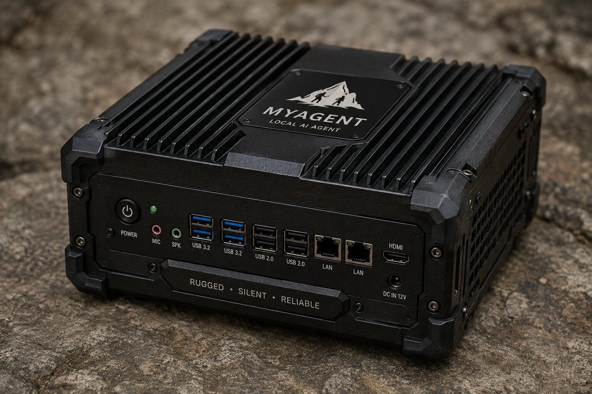
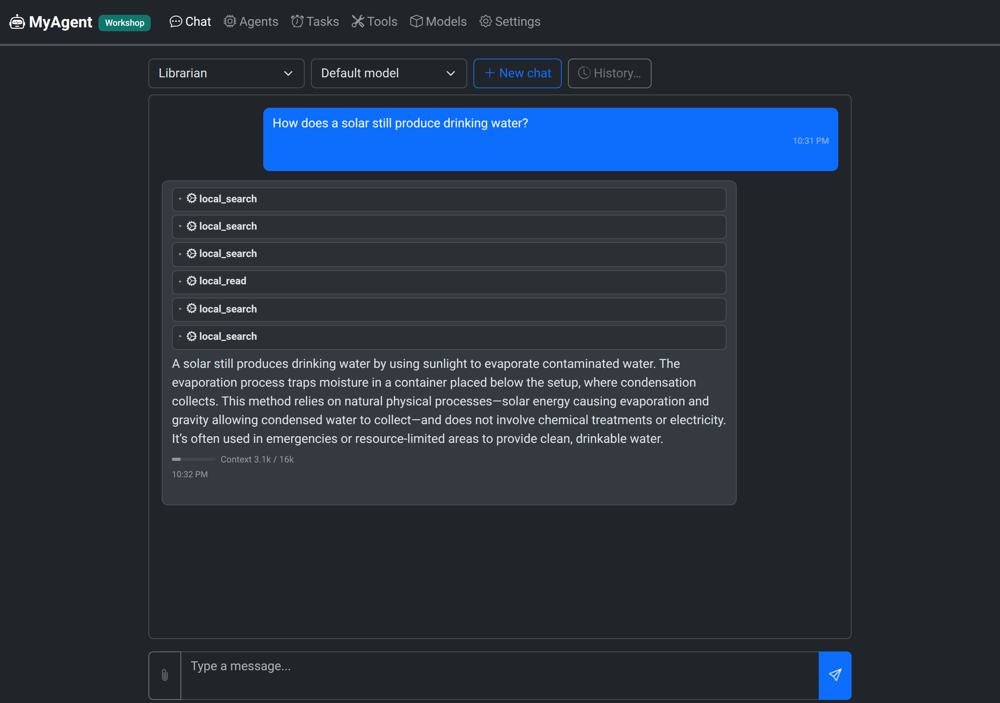

# Open MyAgent

***English** · [Italiano](README.it.md)*

**Your personal AI workstation.**

Runs locally. Works offline. Controls your devices. Answers from a library you
own. Keeps working when everything else stops.



## Not just another AI chat

Most AI assistants are frontends for a cloud model. MyAgent turns an ordinary
computer into a **self-contained AI system**, where the language model is only
one component:

```text
           Local LLM
               │
  Offline knowledge library
               │
       Autonomous agents
               │
       ┌───────┴───────┐
       │               │
  Local tools     IoT devices
       │               │
       └───────┬───────┘
               │
        Your computer
```


No account, no subscription, no telemetry, no vendor lock-in. Point it at a
remote API if you prefer — that's a choice, not a dependency.

## Built for resilience

The internet is optional: your knowledge is stored on disks you own, and your
devices stay on your network. Your assistant keeps working through

- power and network outages that outlast the day,
- disasters and emergencies — the medical, first-aid, repair and agriculture
  references are on a disk you own, and still answer questions,
- remote places — a boat, a camper van, a mountain hut, a field station,
- air-gapped labs, workshops and client sites where connecting is not allowed,
- homes, studios and practices where questions and documents must not leave
  the building.

When the network disappears, the assistant doesn't.

## The offline library

Instead of asking the internet every time, the agents search a collection you
own: **a full offline Wikipedia** alongside medicine, first aid, repair
manuals, agriculture and electronics — plus your own Markdown notes, PDFs and
Word, Excel and PowerPoint documents. Tens or hundreds of gigabytes on your own
disk, searched full-text in moments, quoted with their source
([the library](library/README.md)).



*A local model answering from the offline library: the Librarian searches, opens
the best hit and answers from it. Nothing in that path touches the network.*

## Autonomous AI

MyAgent doesn't only answer questions. Agents run scheduled tasks, monitor and
notify, schedule their own future work, control devices, delegate to other
agents and remember what they did — even while you're away
([autonomous agents](docs/AUTONOMY.md)).

## Privacy by architecture

Privacy is not a feature to switch on: it's the default architecture. There is
no account, no cloud, no analytics, not even a phone-home for updates.
Conversations, documents and device commands stay on hardware you control, and
the only outbound traffic is what you explicitly turn on.

## Philosophy

MyAgent is not another chatbot. It aims to be a **personal AI operating
environment**: an assistant that lives on your own hardware, learns your
documents, uses your tools, controls your devices, and keeps working for
years. Even when the internet doesn't.

## Features

| Feature | Description |
| ------- | ----------- |
| **Any LLM backend** | llama.cpp, Ollama, any OpenAI-compatible API and the Anthropic API, spoken natively; the context window is *probed*, not guessed |
| **Built for small local models** | tool calls parsed from plain text for models without native function calling, loop protection, malformed-call retries ([why](docs/DESIGN.md)) |
| **Offline library** | Wikipedia ZIM archives and your own documents in `~/myagent/library/` (PDF, Word, Excel, PowerPoint, Markdown), searched full-text; full articles and documents deliverable into the chat as files ([details](library/README.md)) |
| **Semantic search** | opt-in: pick a local embedding model and your own documents are matched by meaning as well as by words, across languages — the index builds in the background and never leaves the machine ([details](docs/CONFIGURATION.md#semantic-search-optional)) |
| **Atomic agents** | an agent is just `model + system prompt + tools`, editable from the UI and stored as a JSON file |
| **Autonomous agents** | scheduled tasks, unattended runs, agents that schedule their own future work and notify you ([details](docs/AUTONOMY.md)) |
| **Agent delegation** | agents call other agents, with per-agent permissions |
| **Long-term memory** | opt-in: old turns are archived and replaced by compact summaries, so an agent remembers without blowing a small model's context |
| **Tools are folders** | a `tool.json` plus an executable `run` in any language, hot-reloaded, no restart; the AI can write its own ([details](docs/TOOLS.md)) |
| **Files into the chat** | tools deliver images, HTML pages and downloads into the conversation by reference, never through the model; the HTML Designer agent builds self-contained pages and reports this way ([details](docs/TOOLS.md#returning-files-to-the-user-resources)) |
| **MCP servers** | stdio and HTTP servers join the tool list; paste a Claude Desktop config to import ([details](docs/MCP.md)) |
| **IoT & home automation** | agents call your devices' local HTTP APIs (Home Assistant, Shelly, Tasmota, ESPHome, Hue …) over the LAN ([details](docs/AGENTS.md#local-devices--home-automation)) |
| **Live chat** | token streaming, background generation you can leave and re-attach to, stop button, history, regenerate, prompt editing |
| **Thinking models** | chain-of-thought is separated as it streams and shown collapsed: it never reaches the reply, the next prompt, or a speaker |
| **Telegram and voice** | bridge an agent to a Telegram bot ([connectors](connectors/README.md)) or to a voice satellite, with speech recognised on your own server ([satellite](satellite/README.md)) |
| **Installable UI** | installs as an app and is cached, so it opens with the network down; English and Italian out of the box |

## Quickstart

You need **Python 3.10+** and **one LLM backend**. If you have neither,
[Ollama](https://ollama.com) is the shortest path:

```bash
ollama pull qwen3          # any tool-capable model will do

git clone https://github.com/speleoalex/myagent.git
cd myagent
./install.sh
```

Open the URL it prints (**<http://127.0.0.1:8888>** unless the port was taken),
pick an agent and chat. No sudo: `install.sh` registers MyAgent as a service
that runs *as you*, starts at login and keeps to your own home — several users
on one machine each get their own instance. It reports which backend it found
and offers to install the optional pieces that are missing, and MyAgent answers
on whichever local model is reachable — so the first message works before you
have configured anything. Machine-wide installs, a dedicated service account and
running it by hand (`./install.sh --dev`) are in [INSTALL.md](docs/INSTALL.md).

Then fill the library, which is what makes it useful offline:

```bash
library/fetch.py --list                 # the catalog, with current sizes
library/fetch.py --preset base          # ~1.4 GB starting set
```

Full requirements, optional dependencies, running as a service and
troubleshooting: **[docs/INSTALL.md](docs/INSTALL.md)**.

## Security

> **MyAgent includes tools that execute shell commands as the server user, and
> there is no sandbox.** By default the API has no authentication and binds to
> `127.0.0.1` — keep it that way unless the network is trusted. Before exposing
> it, set an API key in *Settings → API key* (or pin one with
> `MYAGENT_API_KEY`); over plain http, keep the traffic inside a VPN or let
> MyAgent serve HTTPS itself. Treat access to the API as equivalent to a shell
> on the machine.

Threat model, where the secrets live, and how to expose it safely:
**[docs/SECURITY.md](docs/SECURITY.md)**.

## What it is for, and what it is not

MyAgent is a **general-purpose personal assistant**: it searches documents you
own, runs tools on your machine, talks to devices on your network, and answers
in natural language. That is its intended purpose, and the rest follows from it.

It answers **from reference material, as a reference tool**. When the network is
gone and you consult the first-aid, medicine, repair or agriculture archives,
MyAgent does what a shelf of books does — find the page and quote it, with its
source. It is **not** a medical device, and it offers no medical, legal or
financial advice: a language model can be confidently wrong, and nothing it
produces is a professional opinion or a substitute for one.

It is also not built to decide things about people. Screening job applicants,
scoring creditworthiness, ranking students, triaging patients, dispatching
emergency services — all **outside its intended purpose**. Those uses are
regulated (in the EU, high-risk under the AI Act), and configuring MyAgent to
perform one makes *you* the provider of a high-risk system, with the obligations
that come with it.

Who is responsible for what, which parts of the EU AI Act apply, and what is
already built in to help: **[docs/COMPLIANCE.md](docs/COMPLIANCE.md)**.

## Documentation

### Getting it running

- [Installing](docs/INSTALL.md) — requirements, optional dependencies, service,
  installing the UI as an app, hosting it elsewhere, troubleshooting
- [Configuration](docs/CONFIGURATION.md) — environment variables, the
  `~/myagent/` layout, what to back up
- [Security](docs/SECURITY.md) — threat model, API key, transport, secrets
- [Responsibility and the EU AI Act](docs/COMPLIANCE.md) — intended purpose,
  who counts as provider or deployer, transparency, what is built in

### Using it

- [The library](library/README.md) — what offline knowledge is worth having,
  how to download it, how agents search it
- [Agents and devices](docs/AGENTS.md) — the bundled agents, the agent form,
  wiring up your home automation
- [Autonomous agents](docs/AUTONOMY.md) — scheduled tasks, live agents, guard
  rails
- [MCP servers](docs/MCP.md) — adding them, granting them, their limits
- [Connectors](connectors/README.md) — Telegram bots, channels, address book
- [Voice satellite](satellite/README.md) — the speaker/microphone client

### Understanding and extending it

- [Design rationale](docs/DESIGN.md) — why it's built this way, and what is
  deliberately absent
- [Writing tools](docs/TOOLS.md) — anatomy of a tool, the `run` contract, a
  worked example
- [Writing plugins](docs/PLUGINS.md) — the plugin contract, isolation rules
- [Architecture](docs/ARCHITECTURE.md) — request flow, executor, providers,
  context-window probing, storage

## Contributing

Issues and pull requests are welcome. Keep the stack boring: Python standard
library + FastAPI on the backend, vanilla JS + Bootstrap on the frontend, no
build step.

## Credits

Created by **Alessandro Vernassa**
([@speleoalex](https://github.com/speleoalex)).

## License

[MIT](LICENSE). The UI bundles [Bootstrap](https://getbootstrap.com) and
Bootstrap Icons (MIT).
