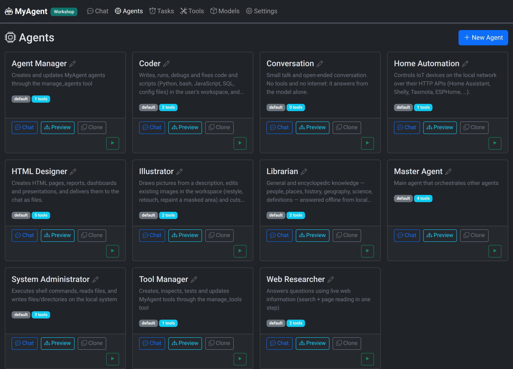

# Agents, and the devices they drive

An agent is `model + system prompt + tools`, stored as a JSON file under
`~/myagent/config/agents/` and editable from the UI.



## The nine bundled agents

First run seeds nine, each running on the model chosen in **Settings**:

| Agent | Does | Needs internet? |
|---|---|---|
| **Master** | orchestrator: routes your question to the right agent, and schedules reminders and recurring jobs for itself | no |
| **Librarian** | answers from the offline library | no |
| **HTML Designer** | builds HTML pages, reports and dashboards and delivers them to the chat | no |
| **Home Automation** | drives IoT devices over their local HTTP APIs — fill in with your own | no |
| **System Administrator** | shell and file operations on the machine; converts PDFs, images and audio to text | no |
| **Conversation** | plain chat, no tools | no |
| **Tool Manager** | writes new tools for the other agents, and tests them | no |
| **Agent Manager** | creates and updates the agents themselves | no |
| **Web Researcher** | searches and reads web pages | yes |

Three are deliberately **not delegatable** (`callable: false`), so Master cannot
route to them: Tool Manager and Agent Manager, which write code and agents — you
select those on purpose — and Master itself, which is the entry point rather
than a target.

**HTML Designer** writes the page as a file in the workspace (`file_write`),
then delivers it with `show_file`: the page appears in the chat as a card that
opens in a sandboxed viewer, and the HTML itself never travels through the
conversation. Its pages are single self-contained files — CSS, JavaScript and
graphics (inline SVG) all embedded, no CDN — so they render offline and can be
copied anywhere as one file. Ask it for a report, a dashboard, a presentation,
or to update a page it made earlier.

If your install predates an agent listed above, it shows in **Agents** as a
dimmed card — one click on *Import* adds it.

## Editing never loses anything

- An agent or tool you changed shows a **modified** badge with a *reset to
  original* button.
- An agent you deleted stays in the list as a dimmed card you can re-import in
  one click.
- Your edits live in `~/myagent/`, outside the install directory, so upgrading
  never overwrites them.

## The agent form

Five tabs — General, Tools, Memory, Autonomy, Advanced — with state indicators
in the tab labels, so you can see from the outside which panes have something
switched on.

Some grants are managed rather than picked: the three memory tools follow the
single *memory* switch, and `call_agent` follows *can delegate*. The autonomy
tools stay individually selectable, because `autonomy_control` is genuinely
useful with `live` off.

## Local devices & home automation

Agents reach the devices on your LAN through the `http_request` tool, which
speaks the local HTTP APIs that home-automation gear already exposes — Home
Assistant, Shelly, Tasmota, ESPHome, Philips Hue, ESP32 sketches, a Raspberry
Pi you wrote yourself. This all happens inside your network: no vendor cloud,
no internet.

The bundled **Home Automation** agent is a template. Open it in **Agents → Home
Automation** and list your devices in the *My devices* section of its system
prompt, one line each with the exact URL to call:

```text
- Living room light (Shelly): ON -> GET http://192.168.1.50/relay/0?turn=on
- Living room light (Shelly): OFF -> GET http://192.168.1.50/relay/0?turn=off
- Home Assistant: POST http://192.168.1.10:8123/api/services/light/turn_on
  header {"Authorization": "Bearer TOKEN"}  body {"entity_id": "light.kitchen"}
- Kitchen temperature: GET http://192.168.1.62/sensor/temp
```

Then just say *"turn on the living room light"*.

Why a prompt and not a device registry: your devices are already described
somewhere (their own docs, your notes), the model reads prose perfectly well,
and a registry would be one more schema to migrate. Keep the lines literal —
the exact URL, the exact header — because the model copies them.

For protocols beyond HTTP (MQTT, Zigbee, serial, GPIO) write a tool: a folder
with a `tool.json` and a `run` script that shells out to `mosquitto_pub`, a
Python library, or whatever your hardware speaks. See [TOOLS.md](TOOLS.md).

## Writing your own agents

Create one from **Agents → New**, or let the AI do it: the **Agent Manager**
creates and updates agents (through `manage_agents`), and the **Tool Manager**
writes and tests their tools (through `manage_tools`). Both are deliberately
not reachable by delegation — you select them on purpose.

A good agent is narrow. Every tool description ends up in the model's prompt,
so an agent with thirty tools spends its context explaining itself instead of
working; that matters most with the small local models this project targets.
Prefer several focused agents and let Master route between them.
