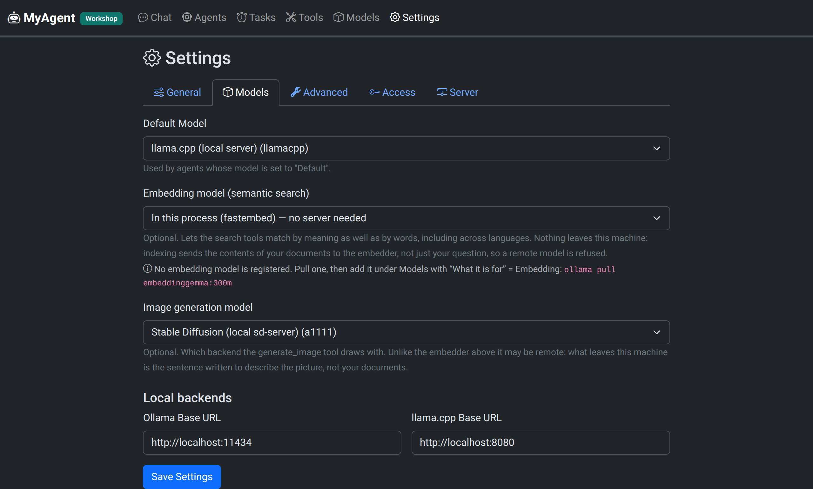

# Configuration and runtime layout

Everything MyAgent needs is configured either from the UI (agents, models,
tools, connectors) or through environment variables. **None of the variables
are required** — the defaults are a working single-user install on localhost.

## Runtime layout

All runtime state lives under `~/myagent/` (one root, moved with
`MYAGENT_HOME`), decoupled from the code, so upgrading or redeploying never
touches your data:

```text
~/myagent/
├── bin/         # the CODE of a per-user or service-account install — replaced by every install.sh run, nothing of yours in here
├── config/      # agents, models (API keys, 0600), MCP servers, settings — small & precious: back this up
├── connectors/  # channel bindings (bot tokens and device keys, 0600), grants, address book
├── plugins/     # installed plugins — code, replaceable (see PLUGINS.md)
├── tools/       # your tools: the ones you (or the AI) create, plus your edits to the built-in ones
├── library/     # your offline knowledge: Wikipedia ZIM archives + notes/documents
├── workspace/   # working directory for agents' file operations (+ _attachments/ scratch, _resources/ files shown in chat)
├── sessions/    # chat state: current, history, connector channels
├── memory/      # per-agent long-term memory (only for agents that enable it)
├── autonomy/    # live agents' state and event queues (only for started agents)
├── cache/       # derived data, safe to delete (pdftext/: PDF text layers; index/: semantic indexes)
└── logs/        # debug.log (only while the debug trace is on in Settings)
```

Two of those directories hold everything that is irreplaceable — a full backup
of what matters:

```bash
tar czf myagent-backup.tgz -C ~ myagent/config myagent/connectors
```

The library is deliberately left out: it is large, and it is re-downloadable
with [`library/fetch.py`](../library/README.md).


## Image generation (optional)

Registering a model of kind **Image** under *Models* and picking it in
Settings → *Image generation* switches on two tools of the `images/` group:
`generate_image` draws a picture from a description, `edit_image` reworks one
that is already in the workspace (whole picture guided by the original, or
only the white area of a mask). The bundled **Illustrator** agent has both,
plus `remove_background`, which needs no image model (see below).
Two endpoint shapes are understood, each with its editing counterpart:

| Provider | Generate | Edit | Typical backend |
|---|---|---|---|
| `a1111` | `POST /sdapi/v1/txt2img` | `POST /sdapi/v1/img2img` | stable-diffusion.cpp's `sd-server`, AUTOMATIC1111 |
| `openai` | `POST /v1/images/generations` | `POST /v1/images/edits` | OpenAI Images API, or any server that speaks it |

Prefer `a1111` for a local backend: it is the only shape that carries
`strength`, `steps`, `seed` and a negative prompt — the OpenAI shape has no
field for them and the tools say so when they are dropped.

- **Only chat models show up as chat models.** The chat picker, the agent
  form and the default-model fallback all skip kind *Image* and kind
  *Embedding*, and the server refuses either wherever a chat model is expected
  — neither can answer a conversation. Likewise Settings → *Image generation*
  lists only kind *Image* and Settings → *Embedding model* only kind
  *Embedding*: each select offers exactly what can do the job.
- **A remote provider is allowed here**, unlike the embedder below: only the
  prompt the agent wrote leaves the machine, never your documents.
- **Defaults live on the model**, in its *Options* (`width`, `height`, `steps`,
  `cfg_scale`, `sampler`); the tool's own parameters override them per call.

### Background removal (no image model)

`remove_background` cuts the subject of a photo out and puts it on a
transparent, uniform or other background, exactly: a salient-object
segmentation network (ISNet, the ONNX export the rembg project publishes)
runs on the CPU inside the tool, and Pillow does the compositing. Nothing is
redrawn, so it is the right tool for "remove the background" — `edit_image`
would repaint the person too. The background may also be a few English words
describing a new scene: the tool then calls `generate_image` itself (through
the same user/bundled overlay as the app, so a per-machine wrapper is
honoured), asks for the empty scene and puts the untouched subject on it; this
is the one case where an image model is involved. It also saves
`<name>-mask.png` (white = background), which `edit_image` accepts as `mask`
to paint a scene only behind the subject.

- **Dependencies**: `onnxruntime`, `pillow` and `numpy` in the app venv,
  installed best-effort by `install.sh` (to repair by hand:
  `server/.venv/bin/pip install onnxruntime pillow numpy`).
- **The model** (178 MB) is offered by `install.sh` and otherwise downloaded on
  first use into `~/myagent/cache/models/` (`MYAGENT_CACHE` moves it). Later
  calls take a second or two on a laptop CPU, about ten on a small ARM board.
- `MYAGENT_BGREMOVE_MODEL` picks another network: `isnet-general-use`
  (default, best edges), `u2net` or `u2net_human_seg` (a 320 px input, much
  faster on a weak CPU, coarser edges). Set it in a systemd drop-in like every
  other environment override.
  An edit keeps the source picture's size and never touches the source file.
  Pictures land in `~/myagent/workspace/` and are shown in the chat.
- **Too small for both models?** A machine that cannot hold the chat model and
  the diffusion model at once (a Jetson Orin Nano 8 GB, say) can alternate
  them around each image with the user-layer wrappers in
  [`contrib/jetson-orin-8gb/`](../contrib/jetson-orin-8gb/README.md).
- **Nothing is picked for you.** Without a choice in Settings the tool fails
  with a clear message and everything else works as before.

## Semantic search (optional)

Choosing an *embedding model* in Settings turns on vector search over your own
documents, alongside the keyword search that is always there. Without one,
nothing changes — including when the optional package below is installed:
nothing is switched on for you.

There are two ways to provide the embeddings.

| Option | What it needs |
|---|---|
| **In this process** (recommended) | the optional `fastembed` package: `server/.venv/bin/pip install fastembed`, then pick *In this process* in Settings. No server, no model to pull, no model to register. The first index run downloads a 241 MB multilingual model into `~/myagent/cache/embed-models/`; `install.sh` offers to fetch it up front. |
| **An embedding endpoint** | a local embedding model pulled and registered under *Models* with *What it is for* = **Embedding** (e.g. `ollama pull embeddinggemma:300m`), then picked in Settings. Use this when you already run one, or want a specific model. An embedder registered as *Chat* before that kind existed keeps working, but is listed only while it is the one in use — re-save it as *Embedding* to get it out of the chat pickers. |

- **Nothing leaves this machine.** Indexing sends the CONTENTS of your
  documents to the embedder — not just your question — so a remote provider is
  refused, both by the settings form and by the server when it exports the
  choice to the tools. The in-process option cannot leak by construction: there
  is no endpoint.
- **A search never downloads the model.** Only a background index run may, so a
  cold cache costs an empty semantic bucket rather than a 241 MB fetch inside a
  tool call with a 30-second timeout.
- **The index lives in `~/myagent/cache/index/`**, one SQLite database per
  indexed folder, named by that folder's path. It is derived data: deleting it
  costs a rebuild, never information. Changing the embedding model discards
  every index, because vectors from two models are not comparable.
- **Building happens in the background**, one folder at a time, and only after
  a search over an unindexed folder asks for it. Settings shows the progress
  and offers a Stop button.
- **Known limit (endpoint option only):** if the embedding model and the chat
  model are served by the same backend with `OLLAMA_NUM_PARALLEL=1`, their
  requests serialize and the assistant feels slower while an index builds.
  Indexing is throttled and niced to soften this, but stopping it from Settings
  is the real remedy. The in-process option does not contend for the model
  server at all — it costs CPU instead, which `nice` handles.

Extra environment variables, both optional:

| Variable | Default | Meaning |
|---|---|---|
| `MYAGENT_EMBED_CACHE` | `$MYAGENT_CACHE/embed-models` | where the in-process embedder keeps its model files |
| `MYAGENT_EMBED_LOCAL` | unset | passed to the tools by the server; set by hand only to run `semindex.py` from a terminal. A model name, or `1` for the default |
| `MYAGENT_EMBED_KEY` | unset | Bearer token sent to `MYAGENT_EMBED_URL`, for an embedding endpoint that requires one |


## Debug trace

*Settings → Debug trace* writes two files under `~/myagent/logs/`:

| File | What it holds |
|---|---|
| `debug.log` | the **narrative** of each turn: iteration by iteration, which tool was called, which results came back, which decisions were taken (dedup, forced answer, protocol downgrade) |
| `api.log` | **every call made to a model**, request payload and reply verbatim — the parameters, the tool schemas actually sent, the complete message list, the reasoning and the tool calls |

`api.log` includes the calls made *outside* a turn — notably the classifier
that picks which agent answers in Auto mode, labelled `auto-route`, so "why did
it choose that agent" is answerable. Each entry is labelled with who made it.

- **It takes effect immediately**, with no restart: the flag is resolved on
  every write, because a debug switch that needs a restart is useless exactly
  when you reach for it. The switch in Settings is the only place it lives —
  there is no environment variable for it.
- **They contain the full text of your conversations.** Turn it on to
  investigate something, then turn it off and press Delete. Settings shows each
  file's path and size, and can show its tail.
- Both files **append** across turns and are bounded by rotation at 20 MB
  each (one previous generation is kept).

## Environment variables

### Network and access

| Variable | Default | Meaning |
|---|---|---|
| `MYAGENT_HOST` | `127.0.0.1` | bind address — see [Security](../README.md#security) before changing it |
| `MYAGENT_PORT` | `8888` | bind port |
| `MYAGENT_API_KEY` | *(unset)* | pin the API key (Bearer header or `?api_key=`); overrides — and makes read-only — the one managed in Settings → API key |
| `MYAGENT_CORS_ORIGINS` | *(unset = same-origin only)* | comma-separated browser origins allowed to call the API, for a [UI hosted elsewhere](INSTALL.md#hosting-the-ui-elsewhere) |
| `MYAGENT_SSL_CERTFILE` | *(unset = plain http)* | TLS certificate — serve HTTPS directly, no reverse proxy |
| `MYAGENT_SSL_KEYFILE` | *(unset)* | TLS private key; omit if the certificate file is a combined PEM |

### Where things are stored

Everything hangs off **one root**, `MYAGENT_HOME`, so moving the whole runtime
layout — a container, a second instance, a test run that must not touch your
real data — is a single variable. Each directory can still be moved on its
own, and its own variable wins over the root:

| Variable | Default | Meaning |
|---|---|---|
| `MYAGENT_HOME` | `~/myagent` | **root of everything below** |
| `MYAGENT_CONFIG` | `$MYAGENT_HOME/config` | agents, models, MCP servers, settings |
| `MYAGENT_TOOLS` | `$MYAGENT_HOME/tools` | tool folders |
| `MYAGENT_WORKSPACE` | `$MYAGENT_HOME/workspace` | agents' file-operation root |
| `MYAGENT_SESSIONS` | `$MYAGENT_HOME/sessions` | chat sessions |
| `MYAGENT_MEMORY` | `$MYAGENT_HOME/memory` | per-agent long-term memory |
| `MYAGENT_AUTONOMY` | `$MYAGENT_HOME/autonomy` | live agents' state and event queues |
| `MYAGENT_LIBRARY` | `$MYAGENT_HOME/library` | offline knowledge folder (library tools) |
| `MYAGENT_CACHE` | `$MYAGENT_HOME/cache` | derived data — currently the PDF text layers the library search reads; deleting it only costs one re-extraction |
| `MYAGENT_PLUGINS` | `$MYAGENT_HOME/plugins` | installed plugins |
| `MYAGENT_CONNECTORS_DIR` | `$MYAGENT_HOME/connectors` | connectors plugin state (bot tokens, address book) |

Pointing `MYAGENT_LIBRARY` at an external disk is the common case — the library
is the one directory that grows to tens of gigabytes — and it is exactly why
the per-directory overrides exist alongside the single root.

**Naming.** A bare noun (`MYAGENT_LIBRARY`) is a *directory*; a suffix means
something else — a file (`MYAGENT_DEBUG_FILE`), a limit
(`MYAGENT_CHANNEL_ROTATE_BYTES`), a behaviour switch. Two directories keep a
`_DIR` suffix for a reason: `MYAGENT_CONNECTORS_DIR`, because the bare name
would read as the head of the `MYAGENT_CONNECTORS_*` knob family below, and
`MYAGENT_INSTALL_DIR`, which is where the *code* is installed rather than
runtime state (read by `install.sh`; default `$MYAGENT_HOME/bin`, or
`/opt/myagent` for a root install — see [INSTALL.md](INSTALL.md#install-modes)).

`MYAGENT_APP_DIR`, `MYAGENT_WORKSPACE`, `MYAGENT_HOME`, `MYAGENT_LIBRARY` and
`MYAGENT_CACHE` are also **passed to every tool** as already-resolved paths
(see [TOOLS.md](TOOLS.md)) — a tool reads them, it never re-derives a path from
`$HOME`.

### Behaviour and diagnostics

| Variable | Default | Meaning |
|---|---|---|
| `MYAGENT_OLLAMA_DEFAULT_CTX` | `4096` | assumed context window of an Ollama model when not probed |
| `MYAGENT_MAX_OUTPUT_CEILING` | `32768` | cap on the `max_tokens` derived from a probed model; an explicit `max_tokens` in the model options bypasses it |
| `MYAGENT_CHANNEL_ROTATE_BYTES` | `2 MiB` | size at which a channel session is archived and restarted |
| `MYAGENT_MCP_SHUTDOWN_TIMEOUT` | `10` | seconds shutdown waits for MCP servers to close |
| `MYAGENT_DEBUG_FILE` | `~/myagent/logs/debug.log` | trace file location |

The **debug trace** is the tool for "why did the agent do that", and it is
switched in Settings — see [above](#debug-trace). There is no environment
variable to enable it: one switch, in one place.

The connectors plugin adds a few of its own (state directory, poll timeout,
Whisper model) — see [connectors/README.md](../connectors/README.md).

## Settings stored in the UI

Some things are configuration but belong to the install rather than the
deployment, so they live in `~/myagent/config/settings.json` and are edited
under **Settings**:

- **Default model** — every bundled agent uses it, so pointing the whole set at
  another model is one choice in one place.
- **Ollama / llama.cpp base URLs** — used to discover models and to probe
  reachability.
- **API key** — generated, rotated or removed without a restart. Overridden by
  `MYAGENT_API_KEY` when that is set.
- **MyAgent server** — a browser-side preference, for when the UI is served
  from somewhere other than the API.
- **Instance name and color** (Settings → *Server*) — how this install
  introduces itself: the name appears next to the *MyAgent* brand in the
  navbar, in the browser tab title, on the home page and as the name of the
  installed app; the color fills that badge and draws a stripe under the
  navbar. Two servers with the same UI are otherwise indistinguishable
  without reading the URL — which a reverse proxy, an installed app or a
  phone hides. Leave the name empty and the host name is shown instead.
  The installed app follows suit: it is called *MyAgent orin*, *MyAgent
  Workshop* and so on rather than plain *MyAgent*, and its title bar takes the
  instance color, so two servers installed on the same phone are told apart
  from the home screen. The name is read at install time; rename the server
  and reinstall the app to see the new one.

The Settings page is split into tabs (*General*, *Models*, *Advanced*,
*Access*, *Server*); the tab is part of the URL (`#/settings/models`), so a
link can point at one.



*Settings → Models: each select lists only models of its own kind (chat,
embedding, image), the local backends are probed for reachability, and the
instance name and color chosen under Server show up in the navbar badge.*
